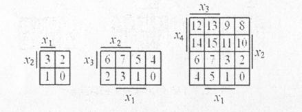
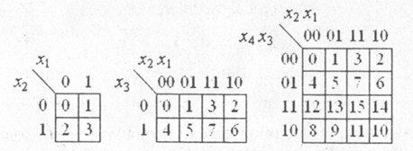

# Тема: Мінімізація перемикальних функцій методом Квайна – Мак-Класки, діаграм Вейча

## 📘 Теоретичні відомості

⚙️ Метод мінімізації Квайна – Мак-Класкі
Метод Квайна – Мак-Класкі є модифікацією методу Квайна і також ґрунтується на співвідношеннях неповного склеювання (3.1) та поглинання (3.2). Особливістю методу є використання цифрової форми запису термів перемикальних функцій.

💡 У цьому випадку зменшується кількість символів для подання термів і кількість операцій у процесі мінімізації, що робить метод зручним для програмної реалізації.

📐 Мінімізацію перемикальних функцій методом Квайна – Мак-Класкі розглянемо на прикладі геометричної інтерпретації.

Кожен набір аргументів (xₙ, ..., x₂, x₁) є n-вимірним вектором, що визначає точку n-вимірного простору.

- Конституентам відповідають вершини куба
  
- Імплікантам – ребра і грані

🧪 Приклад (функція трьох змінних):
📝 Символом Χ позначаються змінні, по яких склеюються терми.

000 ∨ 001 = 000 ∨ 001 ∨ 00Χ

Це відповає: ¬(x₃x₂x₁) ∨ ¬(x₃x₂)x₁ = ¬(x₃x₂x₁) ∨ ¬(x₃x₂)x₁ ∨ ¬(x₃x₂)

🧩 Після поглинання замість двох вершин одержується ребро ¬(x₃x₂) ∨ 00Х.

Аналогічно, виконавши поетапно склеювання та поглинання, два ребра можна замінити на грань:

Χ01 ∨ Χ11 = Χ01 ∨ Χ11 ∨ ΧΧ1

Χ01 ∨ Χ11 ∨ ΧΧ1 = Χ11

⚙️ Рис 1. Геометрична інтерпретація подання перемикальних функцій: а – 0-куби; б – 1-куби; в – 2-куби

🧩 R-куби та комплекси в методі Квайна – Мак-Класкі
Терми максимального рангу (n-рангу) називають 0-кубами і позначають K⁰.
Терми (n–1)-го рангу – 1-кубами (K¹),
(n–2)-го рангу – 2-кубами (K²), і так далі.

- Якщо два 0-куби K⁰ = 000 і K⁰ = 100 розрізняються лише однією координатою, вони утворюють 1-куб K¹ = X00, де Χ – незалежна змінна.

- Якщо два 1-куби K¹ = Χ00 і K¹ = Χ10 мають спільну незалежну змінну і розрізняються однією координатою, вони утворюють 2-куб K² = ΧΧ0.

🧮 Комплекси r-кубів (приклад для функції з рис. 4.1)

K⁰ = {000, 001, 011, 101, 111}

K¹ = {00Χ, Χ01, Χ11, 1Χ1, 0Χ1}

K² = {ΧΧ1}

> Символ Χ позначає змінну, по якій виконано склеювання.

🔁 Комплекс r-кубів (де r = 0, 1, 2, ...) — це множина всіх r-кубів певного рівня абстракції. Комплекси позначаються як Kᵢ

🧮 Етапи мінімізації перемикальних функцій методом Квайна – Мак-Класкі

  1️⃣ Формування комплексу 0-кубів (K⁰)
  Для заданої перемикальної функції виписується комплекс 0-кубів K⁰.
  Куби впорядковують за кількістю одиниць у кожному термі:

  - група з 0 одиницями

  - група з 1 одиницею

  - група з 2 одиницями

  - ...

  > 🔄 Склеювання можливе лише між кубами сусідніх груп (різниця в кількості одиниць — 1).

  2️⃣ Побудова 1-кубів, 2-кубів, …
  Склеювання здійснюється доти, доки воно можливе.

  Склеюються тільки куби, які відрізняються однією змінною, що перетворюється в Χ.

  Склеюються тільки ті пари, які мають Χ в однакових позиціях.

  > 📌 Куби також групуються за кількістю одиниць та кількістю символів Χ.

  3️⃣ Поглинання та формування покриття Z
  Після завершення склеювань:

  Виконують усі можливі поглинання

  Формують множину покриття Z, що відповідає скороченій ДНФ (СДНФ)

  4️⃣ Побудова таблиці покриття
  На основі таблиці:

  Визначають ядро перемикальної функції

  Встановлюють можливі форми:

    ✅ Тупикова ДНФ (ТДНФ)

    ✅ Мінімальна ДНФ (МДНФ)

---

### 📊 Графічний метод мінімізації функцій

Мінімальну ДНФ (МДНФ) можна отримати без формування скороченої та тупикової ДНФ, використовуючи:

🟦 Діаграми Вейча

🟩 Карти Карно

🔍 Особливості методу
Підходить для 2, 3 або 4 змінних

Кожна клітинка відповідає конституенті

Прямокутники з 2^k клітинок → імпліканти

Найбільші прямокутники → прості імпліканти

📐 Принцип роботи
Клітинки розташовані так, що суміжні набори аргументів відрізняються однією змінною

Прямокутники утворюються шляхом об’єднання клітинок, значення яких дорівнює 1

Чим більше клітинок — тим менше змінних у відповідній імпліканті

> ✅ Чим більший прямокутник → тим коротше запис імпліканти

## 🧮 Етапи мінімізації перемикальних функцій графічним методом

1️⃣ **Заповнити діаграму Вейча або карти Карно.**  
   Значення функцій записують у клітинки, що відповідають номерам наборів.

2️⃣ **Виконати об’єднання одиниць у прямокутники**  
   Прямокутники мають містити максимально можливу кількість клітинок (число клітинок має дорівнювати 2ⁿ).  
   Кожна одиниця повинна входити хоча б в один прямокутник. Прямокутник може містити й одну клітинку.

3️⃣ **Визначити МДНФ.**  
   Сукупності простих імплікант, що входять у МДНФ, відповідає мінімальна множина прямокутників, які покривають усі одиниці.

Рисунок 4.2. Графічний метод мінімізації перемикальних функцій: а – діаграми Вейча; б – карти Карно

**а**

**б**

## 🧪 Хід роботи

### 🔢 Задане число

Число: `2211`  
Двійковий запис: `100010100011`

### 📊 Таблиця істинності (Таблиця 3.3)

| x₄ | x₃ | x₂ | x₁ | f₂ | f₂ (модифікована) |
|----|----|----|----|----|-------------------|
| 0  | 0  | 0  | 0  | 0  | 0                 |
| 0  | 0  | 0  | 1  | 1  | 1                 |
| 0  | 0  | 1  | 0  | h₃ | 0                 |
| 0  | 0  | 1  | 1  | h₄ | 0                 |
| 0  | 1  | 0  | 0  | 0  | 0                 |
| 0  | 1  | 0  | 1  | h₅ | 0                 |
| 0  | 1  | 1  | 0  | 0  | 0                 |
| 0  | 1  | 1  | 1  | h₆ | 1                 |
| 1  | 0  | 0  | 0  | h₇ | 0                 |
| 1  | 0  | 0  | 1  | 0  | 0                 |
| 1  | 0  | 1  | 0  | h₈ | 1                 |
| 1  | 0  | 1  | 1  | h₂ | 1                 |
| 1  | 1  | 0  | 0  | 1  | 1                 |
| 1  | 1  | 0  | 1  | h₉ | 0                 |
| 1  | 1  | 1  | 0  | h₁ | 1                 |
| 1  | 1  | 1  | 1  | 1  | 1                 |

### 🧠 Метод мінімізації: Квайна – Мак-Класкі
