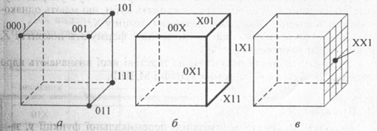

# Тема: Мінімізація перемикальних функцій методом Квайна – Мак-Класки, діаграм Вейча

## 📘 Теоретичні відомості

⚙️ Метод мінімізації Квайна – Мак-Класкі
Метод Квайна – Мак-Класкі є модифікацією методу Квайна і також ґрунтується на співвідношеннях неповного склеювання (3.1) та поглинання (3.2). Особливістю методу є використання цифрової форми запису термів перемикальних функцій.

💡 У цьому випадку зменшується кількість символів для подання термів і кількість операцій у процесі мінімізації, що робить метод зручним для програмної реалізації.

📐 Мінімізацію перемикальних функцій методом Квайна – Мак-Класкі розглянемо на прикладі геометричної інтерпретації.

Кожен набір аргументів (xₙ, ..., x₂, x₁) є n-вимірним вектором, що визначає точку n-вимірного простору.

- Конституентам відповідають вершини куба
  
- Імплікантам – ребра і грані

🧪 Приклад (функція трьох змінних):
📝 Символом Χ позначаються змінні, по яких склеюються терми.

000 ∨ 001 = 000 ∨ 001 ∨ 00Χ

Це відповає: ¬(x₃x₂x₁) ∨ ¬(x₃x₂)x₁ = ¬(x₃x₂x₁) ∨ ¬(x₃x₂)x₁ ∨ ¬(x₃x₂)

🧩 Після поглинання замість двох вершин одержується ребро ¬(x₃x₂) ∨ 00Х.

Аналогічно, виконавши поетапно склеювання та поглинання, два ребра можна замінити на грань:

Χ01 ∨ Χ11 = Χ01 ∨ Χ11 ∨ ΧΧ1

Χ01 ∨ Χ11 ∨ ΧΧ1 = Χ11

⚙️ Рис 1. Геометрична інтерпретація подання перемикальних функцій: а – 0-куби; б – 1-куби; в – 2-куби

🧩 R-куби та комплекси в методі Квайна – Мак-Класкі
Терми максимального рангу (n-рангу) називають 0-кубами і позначають K⁰.
Терми (n–1)-го рангу – 1-кубами (K¹),
(n–2)-го рангу – 2-кубами (K²), і так далі.

- Якщо два 0-куби K⁰ = 000 і K⁰ = 100 розрізняються лише однією координатою, вони утворюють 1-куб K¹ = X00, де Χ – незалежна змінна.

- Якщо два 1-куби K¹ = Χ00 і K¹ = Χ10 мають спільну незалежну змінну і розрізняються однією координатою, вони утворюють 2-куб K² = ΧΧ0.

🧮 Комплекси r-кубів (приклад для функції з рис. 4.1)

K⁰ = {000, 001, 011, 101, 111}

K¹ = {00Χ, Χ01, Χ11, 1Χ1, 0Χ1}

K² = {ΧΧ1}

> Символ Χ позначає змінну, по якій виконано склеювання.
